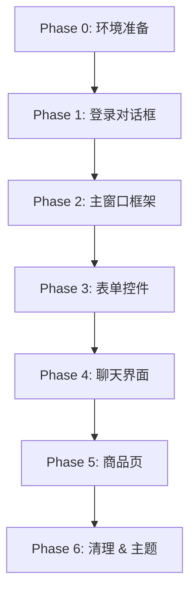

# QFluentWidgets 渐进式迁移计划

将桌面端 UI 从原生 PySide6 + QSS 迁移至 QFluentWidgets (Fluent Design)，实现 Windows 11 级别的现代化界面体验。

## User Review Required

> [!WARNING]
> **许可证确认**：QFluentWidgets 基础版为 GPLv3 开源许可。如果项目为**商业闭源**用途，需购买商业许可。请确认项目许可模式。

> [!IMPORTANT]
> **吸附功能兼容性**：你的 `MainWindow` 目前用 `setFixedSize(400, 720)` 和 `ctypes` 实现微信窗口吸附。由于 QFluentWidgets 的 `MSFluentWindow` 不继承 `QMainWindow`，吸附逻辑需要调整窗口回调挂载点。迁移计划已考虑此兼容性。

> [!IMPORTANT]
> **PySide6 版本兼容性**：你目前使用 `PySide6==6.6.1`。QFluentWidgets 的 PySide6 版本要求 `PySide6>=6.4.0`，兼容你的版本。

---

## 迁移架构总览



每个 Phase 完成后都可以独立运行验证，确保**零宕机风险**。

---

## Phase 0: 环境准备（~15 分钟）

### 安装依赖

```bash
pip install PySide6-Fluent-Widgets -i https://pypi.org/simple/
```

### 验证安装

```python
from qfluentwidgets import PrimaryPushButton, setTheme, Theme
print("QFluentWidgets 安装成功")
```

### 文件备份

在开始之前，将以下文件备份到 `desktop/ui/_backup/` 目录：
- `main_window.py`（核心1633行）
- `login_dialog.py`（76行）
- `style.qss`（395行）
- `../main.py`（419行）

---

## Phase 1: 登录对话框改造（~30 分钟）

> 最小、最独立的组件，适合作为第一个迁移目标。

#### [MODIFY] [login_dialog.py](file:///d:/work_place/desktop/ui/login_dialog.py)

| 原生组件 | → Fluent 组件 | 效果提升 |
|---------|--------------|---------|
| `QDialog` | `MessageBoxBase`（或保持 `QDialog` + Fluent 控件） | 暂保持 QDialog 外壳 |
| `QLabel` (标题) | `SubtitleLabel` | 现代排版 |
| `QLineEdit` (账号) | `LineEdit` | 圆角 + 焦点动画 |
| `QLineEdit` (密码) | `PasswordLineEdit` | 自带密码可见切换图标 |
| `QPushButton` (登录) | `PrimaryPushButton` | 渐变 + 水波纹点击特效 |
| 内联 `setStyleSheet` | **全部删除** | 由 Fluent 主题接管 |

**改造后代码示意**：

```python
from qfluentwidgets import (
    LineEdit, PasswordLineEdit, PrimaryPushButton, SubtitleLabel,
    setTheme, Theme
)

class LoginDialog(QDialog):
    def __init__(self, parent=None):
        super().__init__(parent)
        self.setFixedSize(360, 280)
        
        title = SubtitleLabel("欢迎登录 AI 助手")
        title.setAlignment(Qt.AlignCenter)
        
        self.username_input = LineEdit()
        self.username_input.setPlaceholderText("请输入员工账号")
        
        self.password_input = PasswordLineEdit()
        self.password_input.setPlaceholderText("请输入登录密码")
        
        self.login_btn = PrimaryPushButton("立即验证并登录")
        # 无需任何 setStyleSheet！
```

---

## Phase 2: 主窗口框架改造（~2 小时）⚠️ 核心阶段

> 这是最关键的阶段。主窗口从 `QMainWindow` 迁移到 Fluent 窗口体系。

#### [MODIFY] [main_window.py](file:///d:/work_place/desktop/ui/main_window.py) — MainWindow 类 (L1225-1633)

**方案选择：保持 `QMainWindow`，不迁移到 `FluentWindow`**

> [!NOTE]
> 由于你的窗口有以下特殊需求，我们**不使用** `FluentWindow` / `MSFluentWindow` 基类：
> - `setFixedSize(400, 720)` 固定尺寸窄屏
> - ctypes 吸附微信的 `_on_snap_timeout` 逻辑依赖 `QMainWindow.move()`
> - 侧边栏是**客户列表**而非导航菜单，与 Fluent 的 `NavigationInterface` 定位不同
>
> **策略：保留 `QMainWindow` 壳体，内部控件逐一替换为 Fluent 组件。**

### 2.1 侧边栏 (Sidebar)

| 原生组件 | → Fluent 组件 | 说明 |
|---------|--------------|------|
| `QListWidget` (客户列表) | `ListWidget` (from qfluentwidgets) | 自带平滑滚动 + Fluent 选中态 |
| `QPushButton` (导入/吸附/退出) | `HyperlinkButton` 或 `TransparentToolButton` | 去除 `setFlat` + 手动样式 |

### 2.2 导航栏 (NavBar)

| 原生组件 | → Fluent 组件 |
|---------|--------------|
| 3个 `QPushButton` + 手动 `active` 属性 | `SegmentedWidget` 或 `Pivot` |

`Pivot` 是 QFluentWidgets 提供的 Tab 切换组件，完美匹配你的「对话/画像/商品」三选一场景：

```python
from qfluentwidgets import Pivot

self.pivot = Pivot(self)
self.pivot.addItem(routeKey="chat", text="对话", onClick=lambda: self.stack.setCurrentIndex(0))
self.pivot.addItem(routeKey="info", text="画像", onClick=lambda: self.stack.setCurrentIndex(1))
self.pivot.addItem(routeKey="prod", text="商品", onClick=lambda: self.stack.setCurrentIndex(2))
self.pivot.setCurrentItem("chat")
```

- 自带下划线指示器动画
- 无需手动管理 `active` 属性和 `unpolish/polish` 刷新

### 2.3 删除的 QSS 规则

以下 QSS 选择器在 Phase 2 完成后可安全删除：

- `QWidget#Sidebar` → Fluent 暗色通过 `setTheme` 自动处理
- `QListWidget#CustomerList` 全家桶（含 `::item`、`:hover`、`:selected`）
- `QPushButton#NavBtn` 全家桶
- `QWidget#NavBar`

---

## Phase 3: 客户信息表单改造（~1.5 小时）

#### [MODIFY] [main_window.py](file:///d:/work_place/desktop/ui/main_window.py) — CustomerInfoWidget 类 (L573-736)

| 原生组件 | → Fluent 组件 |
|---------|--------------|
| `QLineEdit` | `LineEdit` |
| `QTextEdit` (画像) | `TextEdit` |
| `NoScrollComboBox` (自定义) | `ComboBox` (自带防滚轮) |
| `MultiSelectComboBox` (自定义) | 保留自定义实现，但内部 model 使用 Fluent 样式 |
| `DatePickerBtn` (自定义) | `CalendarPicker`（如果有）或保留自定义 |
| `RegionCascader` (自定义) | 保留自定义实现，替换内部 `QListWidget` → `ListWidget` |
| `QPushButton#SaveBtn` | `PrimaryPushButton` |
| `QLabel#InfoHeader` | `SubtitleLabel` |
| `QPushButton#HistoryAmountBtn` | `HyperlinkButton` |

**关键收益**：

- 所有输入框自动获得 Fluent 的焦点动画（底部蓝线渐入）
- ComboBox 自带 Fluent 下拉动画和箭头图标
- 无需手动隐藏 `QComboBox::drop-down`

### CascaderPopup 内部改造 (L313-439)

```python
from qfluentwidgets import ListWidget

# 替换三个 QListWidget
self.list_prov = ListWidget()
self.list_city = ListWidget()
self.list_dist = ListWidget()
```

---

## Phase 4: AI 聊天界面改造（~1 小时）

#### [MODIFY] [main_window.py](file:///d:/work_place/desktop/ui/main_window.py) — AIChatWidget 类 (L1124-1223)

| 原生组件 | → Fluent 组件 |
|---------|--------------|
| `QScrollArea` | `SmoothScrollArea` (带惯性滚动) |
| `QTextEdit` (输入框) | `TextEdit` |
| `QPushButton` (发送) | `PrimaryPushButton` + `FluentIcon.SEND` |

### ChatBubble (L992-1122)

> 聊天气泡是高度自定义组件，Fluent 不提供等价物。**保留自定义实现**，但做以下精修：

- `QLabel` → 保留（气泡样式是独立的设计语言，不应被 Fluent 覆盖）
- `QGraphicsDropShadowEffect` → 保留
- 仅替换内联 `setStyleSheet` 中的颜色为 Fluent 主题色变量

### ChatActionToolbar (L955-990)

| 原生组件 | → Fluent 组件 |
|---------|--------------|
| `QPushButton` (emoji 图标) | `TransparentToolButton` + `FluentIcon` |

```python
from qfluentwidgets import TransparentToolButton, FluentIcon

self.btn_copy = TransparentToolButton(FluentIcon.COPY)
self.btn_like = TransparentToolButton(FluentIcon.ACCEPT)
self.btn_dislike = TransparentToolButton(FluentIcon.CLOSE)
self.btn_redo = TransparentToolButton(FluentIcon.SYNC)
```

- 替换掉 emoji 字符（📋👍👎🔄），使用矢量图标
- 自带 hover 圆形高亮效果，无需自定义 QSS

---

## Phase 5: 商品页改造（~1 小时）

#### [MODIFY] [main_window.py](file:///d:/work_place/desktop/ui/main_window.py) — 商品页 (L1321-1503)

| 原生组件 | → Fluent 组件 |
|---------|--------------|
| `TagSearchWidget` 内 `QLineEdit` | `SearchLineEdit` |
| `QListWidget#ProductList` | `ListWidget` |
| `QPushButton#LoadMoreBtn` | `HyperlinkButton` 或 `TransparentPushButton` |
| `QPushButton#SyncBtn` | `ToolButton` + `FluentIcon.SYNC` |
| `QLabel#SyncStatus` | `CaptionLabel` |

### ProductItemWidget (L132-230)

> 保留自定义布局。内部替换：

| 原生 | → Fluent |
|------|---------|
| `QLabel#ProductName` | `BodyLabel`（自带正文排版） |
| `QLabel#ProductPrice` | `StrongBodyLabel` (加粗) |
| `QLabel#ProductSupplier` | `CaptionLabel` (辅助文字) |

---

## Phase 6: 清理与主题配置（~30 分钟）

### 6.1 删除 style.qss

#### [DELETE] [style.qss](file:///d:/work_place/desktop/ui/style.qss)

或改名为 `style.qss.bak` 保留备份。

### 6.2 修改主题初始化

#### [MODIFY] [main.py](file:///d:/work_place/desktop/main.py)

```python
from qfluentwidgets import setTheme, Theme, setThemeColor

class DesktopApp:
    def __init__(self):
        # 替换原有的 _load_stylesheet()
        setTheme(Theme.LIGHT)               # 全局浅色主题
        setThemeColor("#07c160")             # 微信绿作为强调色
```

- 删除 `_load_stylesheet()` 方法
- 删除 `qss_path` 相关逻辑

### 6.3 清理所有内联 setStyleSheet

需要清理以下文件中的所有手动 `setStyleSheet()` 调用：

| 文件 | 调用数量 | 处理方式 |
|------|---------|---------|
| `main_window.py` | ~20处 | 大部分删除，气泡样式保留 |
| `login_dialog.py` | ~4处 | 全部删除 |
| `main.py` | ~3处 | 替换为 Fluent Label 的原生方法 |

---

## 组件映射总表

| 原生 Qt 组件 | QFluentWidgets 替代 | 位置 |
|-------------|---------------------|------|
| `QMainWindow` | **保留**（因吸附需求） | MainWindow |
| `QListWidget` | `ListWidget` | 客户列表、商品列表、级联选择器 |
| `QLineEdit` | `LineEdit` | 表单字段 |
| `QTextEdit` | `TextEdit` | 画像、聊天输入 |
| `QComboBox` | `ComboBox` | 单位/采购类型 |
| `QPushButton` (主操作) | `PrimaryPushButton` | 发送、保存、登录 |
| `QPushButton` (次要) | `TransparentPushButton` | 退出、导入 |
| `QPushButton` (链接) | `HyperlinkButton` | 历史金额、加载更多 |
| `QPushButton` (图标) | `TransparentToolButton` | 工具栏图标 |
| `QScrollArea` | `SmoothScrollArea` | 聊天滚动区 |
| `QLabel` (标题) | `SubtitleLabel` | 侧栏标题、表单标题 |
| `QLabel` (正文) | `BodyLabel` | 商品名称 |
| `QLabel` (辅助) | `CaptionLabel` | 供应商、同步状态 |
| `QStackedWidget` | **保留** | 功能切换 |
| 3个 Tab 按钮 | `Pivot` | 导航栏 |
| emoji 图标按钮 | `TransparentToolButton` + `FluentIcon` | 聊天工具栏 |

---

## PySide6 版本兼容性说明

你的项目使用 `PySide6==6.6.1`，QFluentWidgets 对此完全兼容。但有一个注意点：

> [!WARNING]
> `PySide6-Fluent-Widgets` 和 `PySideSix-Frameless-Window` **不会冲突**。QFluentWidgets 内部已包含自己的无边框窗口实现。如果你不再使用 `PySideSix-Frameless-Window` 的其他功能，可以在完成迁移后卸载它。

---

## Open Questions

> [!IMPORTANT]
> **1. 商业许可**：你的项目是否为商业用途？如果是，需要购买 QFluentWidgets 商业许可证。

> [!IMPORTANT]
> **2. 深色模式**：是否需要支持深色模式切换？QFluentWidgets 支持 `setTheme(Theme.DARK)` 一键切换。如果需要，我会在侧边栏底部加一个主题切换开关。

> [!IMPORTANT]
> **3. 迁移节奏**：建议从 Phase 1 开始逐步推进。你希望我从哪个 Phase 开始执行？还是一次性完成全部 6 个 Phase？

---

## Verification Plan

### 每阶段验证

每完成一个 Phase，执行以下验证：

```bash
cd d:\work_place\desktop
python main.py
```

检查项：
1. ✅ 窗口正常启动，无 ImportError
2. ✅ 替换后的控件正常渲染，无布局错位
3. ✅ 功能正常（登录 → 客户列表 → AI对话 → 商品搜索）
4. ✅ 吸附微信功能正常工作
5. ✅ 原有信号/槽连接未断裂

### 最终验证

- 全流程功能测试：登录 → 选客户 → AI 对话 → 保存画像 → 搜索商品 → 复制图片
- 吸附微信定位功能
- 窗口关闭/注销/重启流程
