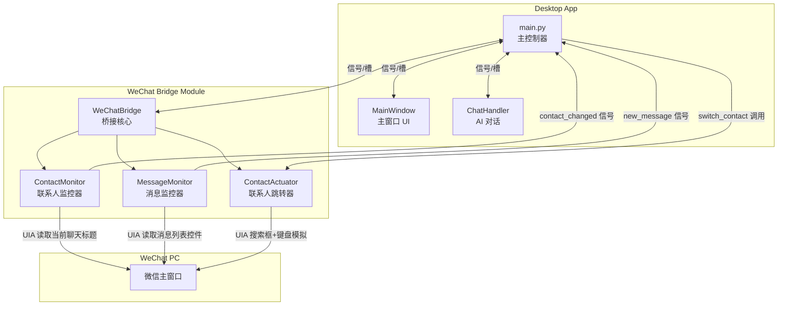

# 微信深度联动方案 — 技术架构设计

## 目标概述

在现有**窗口吸附**能力的基础上，进一步打通桌面端与微信 PC 客户端的业务数据流，实现以下三大核心场景：

| # | 功能 | 描述 |
|---|------|------|
| F1 | **消息自动同步** | 微信中客户发来的消息，自动同步到我们 AI 对话页的发送框 |
| F2 | **微信→软件：联系人自动跟随** | 在微信中切换聊天对象时，软件自动识别并跳转到对应客户的画像/对话界面 |
| F3 | **软件→微信：主动切换联系人** | 在软件侧边栏选择客户后，微信自动跳转到该客户的聊天窗口 |

---

## 可行性结论

> [!IMPORTANT]
> **结论：完全可行。** 核心技术路线是 **Windows UI Automation (UIA) API**，通过读取微信窗口的控件树来获取消息和联系人信息，无需修改微信底层代码。

### 技术前提条件

- 微信 PC 客户端必须处于**已登录 & 可见**状态（不能最小化到托盘）
- 微信窗口中的 UI 控件需要**暴露 Accessibility 属性**（绝大多数版本支持）
- 桌面端程序需要以**普通用户权限**运行（UIA 不要求管理员权限）
- 微信版本更新可能导致控件结构变化，需要**版本适配维护**

---

## 核心架构设计

### 新增模块：`wechat_bridge.py`

在 `desktop/` 目录下新增一个独立的微信桥接模块，负责所有与微信 UI 交互的逻辑。采用**观察者模式 + 轮询监控**的混合架构。

```
desktop/
├── main.py              # 主控制器 (已有)
├── chat_handler.py      # AI 对话处理 (已有)
├── wechat_bridge.py     # [NEW] 微信桥接模块
├── api_client.py        # API 通讯层 (已有)
└── ui/
    └── main_window.py   # 主窗口 UI (需修改)
```

### 架构层次图



---

## 详细方案设计

### 方案选型：`uiautomation` vs `wxauto`

| 维度 | `uiautomation` (底层库) | `wxauto` (封装库) |
|------|------------------------|-------------------|
| 灵活性 | ⭐⭐⭐⭐⭐ 完全可控 | ⭐⭐⭐ 受封装限制 |
| 开发速度 | ⭐⭐⭐ 需自行定位控件 | ⭐⭐⭐⭐⭐ 开箱即用 |
| 版本适配 | ⭐⭐⭐⭐ 自行维护 | ⭐⭐⭐ 依赖作者更新 |
| 稳定性 | ⭐⭐⭐⭐ 自控容错 | ⭐⭐⭐ 黑盒风险 |
| 与现有架构兼容 | ⭐⭐⭐⭐⭐ | ⭐⭐⭐ 同步阻塞模型 |

> [!TIP]
> **推荐方案：基于 `uiautomation` 自研桥接模块。** 原因：`wxauto` 是同步阻塞模型，与我们 `qasync` 异步架构冲突严重；`uiautomation` 可以通过 `asyncio.to_thread()` 无缝桥接到异步主循环。

---

### F1：消息自动同步到发送框

#### 实现原理

通过 UIA 定位微信消息列表控件，周期性（每 500ms）扫描最后几条消息，检测是否有新消息。当检测到新消息时，提取文本内容并通过 Qt 信号发送给主控制器。

#### 核心逻辑

```python
# wechat_bridge.py 中的 MessageMonitor 类

class MessageMonitor:
    """监控微信消息列表，检测新来消息"""
    
    def __init__(self):
        self._last_msg_count = 0
        self._last_msg_hash = ""
    
    def get_latest_messages(self, wechat_window) -> list[dict]:
        """读取当前聊天窗口的最新消息"""
        # 1. 定位消息列表控件 (ListControl)
        msg_list = wechat_window.ListControl(Name="消息")
        if not msg_list.Exists(0, 0):
            return []
        
        # 2. 获取所有子项 (ListItemControl)
        items = msg_list.GetChildren()
        messages = []
        for item in items[-5:]:  # 只读最近 5 条，降低开销
            name = item.Name  # 格式通常为 "联系人名\n消息内容"
            messages.append({"raw": name, "text": self._parse_text(name)})
        
        return messages
    
    def detect_new_messages(self, wechat_window) -> list[str]:
        """差量检测：返回自上次检查以来的新消息"""
        current = self.get_latest_messages(wechat_window)
        current_hash = hash(str(current))
        
        if current_hash != self._last_msg_hash:
            self._last_msg_hash = current_hash
            # 返回增量消息
            return [m["text"] for m in current[self._last_msg_count:]]
        return []
```

#### 用户体验

- 客户在微信发消息 → 桌面端底部输入框自动填入该消息文本（非自动发送）
- 业务员可以编辑/补充后再发送给 AI，形成"客户原话 + 业务员补充"的复合提问模式
- 通过一个开关控制是否启用此功能（防止消息轰炸时干扰工作）

---

### F2：微信→软件 联系人自动跟随

#### 实现原理

周期轮询微信窗口标题栏区域的"当前聊天对象名称"控件。当检测到名称变化时，在本地客户列表中做模糊匹配（优先匹配 `wechat_remark` 字段，其次匹配 `customer_name`），自动触发 `customer_selected` 信号。

#### 核心逻辑

```python
class ContactMonitor:
    """监控微信当前聊天对象的变化"""
    
    def __init__(self):
        self._current_contact = ""
    
    def get_current_contact(self, wechat_window) -> str:
        """获取微信当前聊天对象的名称"""
        # 微信聊天标题通常在一个 TextControl 或 ButtonControl 中
        # 需要通过 Inspect.exe 确认具体的控件路径
        
        # 方案 A: 直接读取聊天区域标题
        title_ctrl = wechat_window.TextControl(searchDepth=15)
        # 实际需要精确定位，这里是示意
        
        # 方案 B: 读取整个窗口标题（部分微信版本会在标题栏显示联系人名）
        # 格式可能为 "联系人名 - 微信"
        
        return title_ctrl.Name if title_ctrl.Exists(0, 0) else ""
    
    def check_contact_changed(self, wechat_window) -> str | None:
        """检测联系人是否变化，返回新联系人名或 None"""
        current = self.get_current_contact(wechat_window)
        if current and current != self._current_contact:
            self._current_contact = current
            return current
        return None
```

#### 客户匹配策略

```python
def match_customer(self, wechat_name: str) -> dict | None:
    """将微信联系人名匹配到系统中的客户记录"""
    customers = self._get_all_customers()
    
    # 优先级 1: 精确匹配微信备注 (wechat_remark)
    for c in customers:
        if c.get("wechat_remark") == wechat_name:
            return c
    
    # 优先级 2: 精确匹配客户姓名 (customer_name)
    for c in customers:
        if c.get("customer_name") == wechat_name:
            return c
    
    # 优先级 3: 模糊匹配（微信名包含客户名或反之）
    for c in customers:
        name = c.get("customer_name", "")
        remark = c.get("wechat_remark", "")
        if name in wechat_name or wechat_name in name:
            return c
        if remark and (remark in wechat_name or wechat_name in remark):
            return c
    
    return None  # 未匹配到，不触发跳转
```

> [!WARNING]
> **客户匹配的关键前提：** 业务员需要在客户画像中维护好 `微信备注` 字段。如果该字段为空，系统只能依赖 `客户姓名` 做匹配，准确率会降低。建议在 UI 中强化引导用户填写此字段。

---

### F3：软件→微信 主动切换联系人

#### 实现原理

当业务员在侧边栏选择某个客户时，通过 UIA 模拟微信的搜索操作：触发 `Ctrl+F` 打开搜索框 → 输入客户名/微信备注 → 选择搜索结果。

#### 核心逻辑

```python
class ContactActuator:
    """主动控制微信切换到指定联系人"""
    
    def switch_to_contact(self, wechat_window, contact_name: str) -> bool:
        """通过模拟搜索操作切换到指定联系人"""
        try:
            # 1. 将微信窗口激活到前台
            wechat_window.SwitchToThisWindow()
            time.sleep(0.3)
            
            # 2. 通过 Ctrl+F 触发搜索
            wechat_window.SendKeys('{Ctrl}f', waitTime=0.5)
            
            # 3. 在搜索框中输入联系人名称（使用剪贴板粘贴避免输入法干扰）
            import pyperclip
            pyperclip.copy(contact_name)
            wechat_window.SendKeys('{Ctrl}v', waitTime=0.5)
            
            # 4. 等待搜索结果并点击第一个匹配项
            time.sleep(0.8)
            wechat_window.SendKeys('{Enter}', waitTime=0.3)
            
            # 5. 按 Esc 关闭搜索框
            wechat_window.SendKeys('{Escape}')
            
            return True
        except Exception as e:
            logger.error(f"切换微信联系人失败: {e}")
            return False
```

> [!CAUTION]
> **剪贴板冲突风险：** 使用 `pyperclip.copy()` 会覆盖用户当前剪贴板内容。实现时需要先保存剪贴板原始内容，操作完成后恢复。

---

## WeChatBridge 总体设计

```python
# desktop/wechat_bridge.py

import asyncio
import ctypes
import time
from PySide6.QtCore import QObject, Signal, QTimer
from logger_cfg import logger

class WeChatBridge(QObject):
    """
    微信桥接核心模块：统一管理与微信 PC 客户端的所有交互逻辑。
    采用 QTimer 轮询 + 信号/槽 的事件驱动架构。
    """
    # 信号定义
    contact_changed = Signal(str)       # 微信当前聊天对象变更
    new_message_received = Signal(str, str)  # (发送者, 消息内容)
    bridge_error = Signal(str)          # 桥接错误通知
    
    POLL_INTERVAL_MS = 500  # 轮询间隔 (毫秒)
    
    def __init__(self, parent=None):
        super().__init__(parent)
        self._enabled = False
        self._wechat_hwnd = None
        
        self._contact_monitor = ContactMonitor()
        self._message_monitor = MessageMonitor()
        self._contact_actuator = ContactActuator()
        
        self._poll_timer = QTimer(self)
        self._poll_timer.timeout.connect(self._on_poll)
        
        # 功能开关
        self.auto_sync_messages = True
        self.auto_follow_contact = True
    
    def start(self):
        """启动桥接服务"""
        self._enabled = True
        self._poll_timer.start(self.POLL_INTERVAL_MS)
        logger.info("微信桥接服务已启动")
    
    def stop(self):
        """停止桥接服务"""
        self._enabled = False
        self._poll_timer.stop()
        logger.info("微信桥接服务已停止")
    
    def _on_poll(self):
        """定时轮询：在子线程中执行 UIA 操作，避免阻塞 GUI"""
        asyncio.create_task(self._async_poll())
    
    async def _async_poll(self):
        """异步轮询核心逻辑"""
        try:
            wechat_win = await asyncio.to_thread(self._find_wechat_window)
            if not wechat_win:
                return
            
            # F2: 联系人跟随检测
            if self.auto_follow_contact:
                new_contact = await asyncio.to_thread(
                    self._contact_monitor.check_contact_changed, wechat_win
                )
                if new_contact:
                    self.contact_changed.emit(new_contact)
            
            # F1: 新消息检测
            if self.auto_sync_messages:
                new_msgs = await asyncio.to_thread(
                    self._message_monitor.detect_new_messages, wechat_win
                )
                for msg in new_msgs:
                    self.new_message_received.emit("customer", msg)
                    
        except Exception as e:
            logger.error(f"微信桥接轮询异常: {e}")
    
    async def switch_wechat_contact(self, contact_name: str):
        """F3: 从软件驱动微信切换联系人"""
        wechat_win = await asyncio.to_thread(self._find_wechat_window)
        if wechat_win:
            success = await asyncio.to_thread(
                self._contact_actuator.switch_to_contact, wechat_win, contact_name
            )
            if not success:
                self.bridge_error.emit("无法切换微信联系人，请确认微信窗口正常运行")
```

---

## 与现有架构的集成点

### 1. `main.py` (主控制器) 修改

```python
# 在 DesktopApp.__init__ 中新增
self.wechat_bridge = WeChatBridge()

# 在 launch() 登录成功后连接信号
self.wechat_bridge.contact_changed.connect(self._handle_wechat_contact_changed)
self.wechat_bridge.new_message_received.connect(self._handle_wechat_new_message)

# 新增处理方法
async def _handle_wechat_contact_changed(self, wechat_name):
    """当微信切换聊天对象时，自动匹配并跳转到对应客户"""
    matched = self.wechat_bridge.match_customer(wechat_name, self._all_customers)
    if matched:
        self.main_win.select_customer_by_phone(matched.get("phone"))
        await self._handle_customer_selected(matched)

def _handle_wechat_new_message(self, sender, text):
    """当微信收到新消息时，自动填入发送框"""
    self.main_win.chat_page.input_edit.setPlainText(text)
```

### 2. `main_window.py` (UI) 修改

- 在侧边栏添加**微信联动**开关按钮
- 在 `_on_customer_item_clicked` 中增加触发微信跳转的逻辑
- 新增 `select_customer_by_phone()` 方法，用于程序化选中客户

### 3. 数据库/后端无需改动

所有联动逻辑在桌面端本地完成，不涉及后端 API 变更。

---

## 风险与挑战

| 风险 | 等级 | 应对策略 |
|------|------|---------|
| 微信版本更新导致控件结构变化 | 🔴 高 | 将控件路径配置化，支持用户手动指定 `searchDepth` 和控件名；提供"诊断模式"打印控件树 |
| UIA 操作阻塞 GUI 线程 | 🟡 中 | 全部通过 `asyncio.to_thread()` 异步化管线执行 |
| 剪贴板冲突（F3 操作会覆盖剪贴板） | 🟡 中 | 操作前保存 → 操作后恢复剪贴板内容 |
| 客户名匹配不准确 | 🟡 中 | 优先使用 `微信备注` 字段做精确匹配；未匹配时不自动跳转，改为弹出候选列表 |
| 微信最小化时无法操作 | 🟢 低 | 检测微信可见性，不可见时暂停桥接并提示用户 |
| 腾讯反自动化检测 | 🟢 低 | 我们只读取控件属性，不模拟频繁点击；F3 搜索跳转频率由用户手动触发，频率极低 |

---

## 分阶段实施路线

### Phase 1：基础设施搭建（预计 2-3 天）

- [ ] 安装 `uiautomation` 依赖
- [ ] 创建 `wechat_bridge.py` 基础框架
- [ ] 实现 `_find_wechat_window()` 复用现有校准逻辑
- [ ] 使用 `Inspect.exe` 分析微信控件树，确定关键控件路径
- [ ] 实现控件路径配置化存储（QSettings）

### Phase 2：F2 联系人跟随（预计 2 天）

- [ ] 实现 `ContactMonitor` 类
- [ ] 实现客户名匹配算法
- [ ] 集成到 `main.py` 信号路由
- [ ] UI 添加联动开关

### Phase 3：F1 消息同步（预计 2-3 天）

- [ ] 实现 `MessageMonitor` 类
- [ ] 实现消息差量检测
- [ ] 集成到 `chat_page.input_edit` 的自动填充
- [ ] 添加消息同步开关和视觉提示

### Phase 4：F3 软件→微信跳转（预计 1-2 天）

- [ ] 实现 `ContactActuator` 类
- [ ] 集成剪贴板保护逻辑
- [ ] 在 `_handle_customer_selected` 中加入触发逻辑
- [ ] 异常处理与用户反馈

### Phase 5：打磨与稳定性（预计 2 天）

- [ ] 异常容错强化
- [ ] 微信版本兼容性测试
- [ ] 性能调优（轮询间隔、UIA 搜索深度）
- [ ] 诊断模式开发

---

## 新增依赖

```
uiautomation>=2.0.18    # Windows UI Automation Python封装
pyperclip>=1.8.0         # 跨平台剪贴板操作 (F3 搜索跳转用)
```

---

## Open Questions

> [!IMPORTANT]
> **微信版本确认：** 要准确实现控件定位，需要确认您当前使用的微信 PC 版本号。不同版本的控件类名和层级结构差异较大。您能提供一下当前微信版本吗？（右下角 微信设置 → 关于微信）

> [!IMPORTANT]  
> **功能优先级：** 三个功能（F1/F2/F3）您最希望优先实现哪个？建议先落地 F2（联系人跟随），因为它是其他功能的基础。

> [!WARNING]
> **合规提醒：** 通过 UI Automation 操作微信属于非官方途径。功能仅限于**本地辅助办公**用途，不用于批量营销或自动化群发。请确认这与您的使用场景一致。

## Verification Plan

### Automated Tests
- 在 `wechat_bridge.py` 中为每个 Monitor/Actuator 类编写单元测试（模拟 UIA 返回值）
- 创建集成测试脚本，验证信号发射是否正确传递到主控制器

### Manual Verification
- 手动在微信中切换 3-5 个不同联系人，观察桌面端是否正确跟随跳转
- 手动让联系人发送消息，检查消息是否出现在发送框中
- 从软件侧选择客户，确认微信是否正确跳转到对应聊天
- 测试微信最小化/关闭后的异常处理
